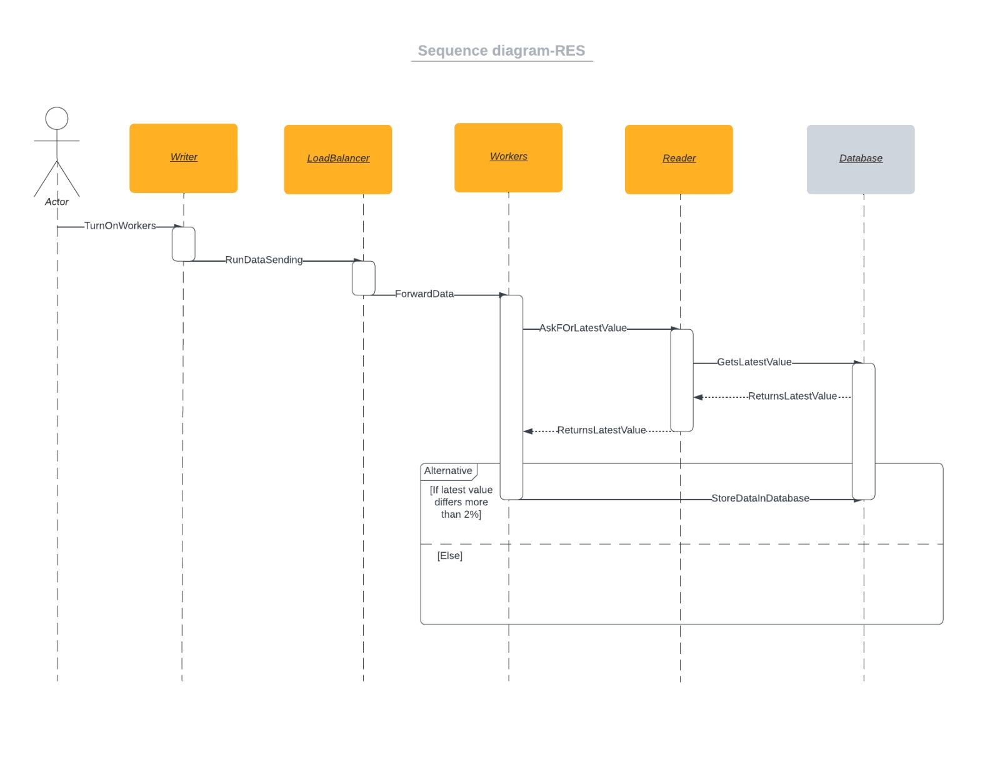

# Predmetni projekat - projektna dokumentacija

### Uopšteno:
Naš projektni zadatak simulira primanje, prosleđivanje, čitanje iz baze i smeštanje u bazu podataka. Koristile su se četiri osnovne komponente opisane u nastavku i prikazane na dijagramu.

## Komponente

1. **Writer** - komunicira sa LoadBalancer komponentom. Šalje joj generisane kodove i vrednosti, a ujedno ima mogućnost ručnog paljenja i gašenja worker rola.

1. **LoadBalancer** - pre prosleđivanja podataka koji su prepakovani putem description strukture workerima, on kod sebe čuva podatke. Prima od writer komponente informacije i posao raspoređuje ravnomerno workerima tako što koristi *Round Robin* algoritam.

1. **Reader** - on je u stalnoj vezi sa workerom kako bi dobio poslednje vrednosti code-ova, iščitao istorijske vrednosti za određeni code, iščitao iz baze podatke i ispisao iste.

1. **Worker** - od LoadBalancera dobija podatke i beleži ih u svoju memoriju po dataset-u. Čuva ih u zavisnosti od Deadband uslova, a to je ukoliko je nova vrednost veća od 2% od starije vrednosti i ukoliko se radi o CODE_DIGITAL. 
 

Dijagram komponenti:

Sekvencijalni dijagram:

## Scenario aplikacije:
Worker na svake dve sekunde šalje random generisane kodove i vrednosti LoadBalancer-u. Nakon toga LoadBalancer smešta kod sebe u bafer podatke i iste šalje na dalju obradu Workerima. 

Ako je nulti worker zauzet, zahtev će se proslediti prvom sledećem slobodnom workeru. Kada primi code i value od writer, LB prepakuje u svoju strukturu a kada pošalje writeru i on takođe prepakuje u svoju strukturu.

Worker čim primi podatke, prvo dobavi iz baze poslednju upisanu vrednost zatim primeni Deadband proveru i upisuje u skladu sa uslovom te podatke i timestamp koji je izgenerisao prilikom upisa u bazu.

Reader nam služi da išcita poslednje vrednosti za određeni CODE. Logger se koristi za praćenje  upisa vrednosti.

Program se pokreće preko komandne linije gde korisnik može izabrati sedam opcija, a one su sledeće:
1. Show worker statuses - prikazuju aktivne workere ali da lista ne bi bila prazna prethodno treba uključiti workere biravši opciju broj 4
1. Show last value by code - pritisnuvši ovaj odabir pojavljuje se lista svih 8 kodova i od korisnika se očekuje da selektuje 1, a  nakon toga sledi ispis u jednoj liniji poslednje vrednosti određenog koda
1. Show code values in time interval - slično prethodnoj stavci, osim što dodatno zahteva da se unese vremenski interval
1. Turn on new workers - paljenje određenog broja workera
1. Turn off existing workers - od korisnika se očekuje da izaberekog workera želi da isključi
1. Track logger - možemo imati uvid u Loggerkako prati pakete.
1. Exit - isključenje iz programa, a samim tim se i niti koje su sve vreme radile u pozadini gase

Studenti koji su učestvovali u izradi zadatka:
1. Nikola Knežević PR96/2019
2. Srđan Stanojčić PR92/2019
3. Irena Varga PR103/2019
4. Katarina Dabetić PR94/2019
